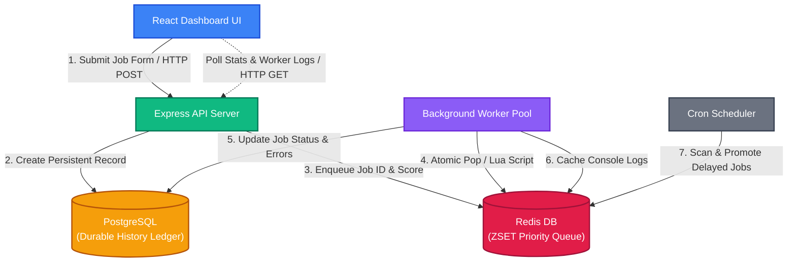

# ⚡ TaskQ — Distributed Job Queue & Task Scheduler
## Master Project & Interview Guide

This guide compiles the entire system design, architecture, demo procedures, and common interview questions for **TaskQ** in a single place to help you nail your system design and coding interviews.

---

## 1. The Core Concept (Why TaskQ?)

When a user performs an action on a website that takes a long time (like uploading a video, generating a PDF invoice, or sending a registration email), the web server should **not** block the client request waiting for that task to finish. 

If the web server processes heavy workloads synchronously during the request:
- The user experiences a frozen page.
- Connection timeouts occur under load.
- The server quickly runs out of thread pool capacity.

**TaskQ solves this by offloading slow, heavy tasks to run asynchronously in the background.** It splits the application into two decoupled services: an **ingestion server** and a **worker pool**, communicating via a **priority queue (Redis)** and a **history ledger (PostgreSQL)**.

---

## 2. System Architecture



### Components:
*   **React Frontend Dashboard:** Polls the database status metrics (every 2s) and the Redis console log buffer (every 1s) to show real-time progress.
*   **Express API Server:** Exposes a fast endpoint (`POST /api/jobs`) to accept jobs and return an immediate response.
*   **Redis Queue (Sorted Set):** Uses the job priority number as the ZSET score. Since lower scores win, it naturally forms a **distributed min-priority heap**.
*   **Postgres Job Store:** Acts as a persistent, queryable log of every job's full history (queued -> processing -> completed / retrying / dead_letter) for auditing and stats.
*   **Background Worker Pool:** Autonomous Node.js loops that run concurrently. They pop the highest-priority job ID from Redis, lookup the task handler, and run it.

---

## 3. The 12-Job Interview Demonstration

To prove to an interviewer that the priority queue, retries, and dead-lettering systems work, we run a **12-Job Demo**. By pausing the worker, enqueuing the jobs, and then resuming the worker, we can observe the queue sorting and processing the jobs in real time.

### How to Run the Demo Step-by-Step

1.  **Stop the Worker Process:**
    Ensure no workers are running (stop the worker terminal process).
2.  **Clean logs in Redis (Optional):**
    Click the **Clear Output** button on the dashboard console.
3.  **Enqueue the 12 Jobs:**
    In your backend folder, run the demo script:
    ```bash
    npm run demo
    ```
    This script will push 12 jobs to the queue in **random order** with different priorities and demo payloads.
4.  **Open the Dashboard:**
    Go to `http://localhost:5173/`. You will see **Queued: 12** on the stats panel.
5.  **Start the Worker:**
    In your backend terminal, run:
    ```bash
    npm run worker
    ```
6.  **Watch the Console Logs on the Dashboard:**
    Observe the sorting order and execution steps stream in.

---

### Detailed Job Execution Log Analysis (The 12-Job Sequence)

The 12 jobs enqueued by `npm run demo` are processed strictly in this priority-sorted order:

| Step | Job ID / Target | Priority | Type | Expected Behavior |
| :--- | :--- | :--- | :--- | :--- |
| **1** | `success5.png` | **1** | `resizeImage` | **Executed first** because Priority 1 is the highest priority in the queue. Completes successfully. |
| **2** | `success4@demo.com` | **2** | `sendEmail` | Dequeued next (Priority 2). Completes successfully. |
| **3** | `success9.png` | **2** | `resizeImage` | Dequeued next (Priority 2). Completes successfully. |
| **4** | `success8@demo.com` | **3** | `sendEmail` | Dequeued next (Priority 3). Completes successfully. |
| **5** | `always-fail@demo.com`| **3** | `sendEmail` | **Temporary Fail & Retry Demo:** Dequeued next (Priority 3). Fails with SMTP connection error. The retry service schedules it for **Retry #1** with a 2-second delay. |
| **6** | `retry-once@demo.com` | **4** | `sendEmail` | **Fail-once success Demo:** Dequeued next (Priority 4). Fails on the first attempt with a temporary timeout. Scheduled for **Retry #1** with a 2-second delay. |
| **7** | `success3.png` | **5** | `resizeImage` | Dequeued next (Priority 5). Completes successfully. |
| **8** | `Trigger immediate DLQ`| **6** | `invalidType` | **Immediate DLQ Demo:** Dequeued next (Priority 6). Since there is no `invalidType` handler registered in `backend/handlers/index.js`, the worker bypasses retries entirely and routes it straight to the **Dead-Letter Queue (DLQ)**. |
| **9** | `success6@demo.com` | **7** | `sendEmail` | Dequeued next (Priority 7). Completes successfully. |
| **10**| `success1.png` | **8** | `resizeImage` | Dequeued next (Priority 8). Completes successfully. |
| **11**| `success2@demo.com` | **9** | `sendEmail` | Dequeued next (Priority 9). Completes successfully. |
| **12**| `success7.png` | **10** | `resizeImage` | **Executed last** because Priority 10 is the lowest priority in the queue. Completes successfully. |

#### What happens to the Retrying Jobs?
*   **`retry-once@demo.com`**: After its 2-second delay, the scheduler promotes it back to the active queue. The worker dequeues it again and it succeeds on this second attempt!
*   **`always-fail@demo.com`**: After its first failure, it is retried. It fails again, schedules **Retry #2** (4s delay), fails again, schedules **Retry #3** (8s delay). After the 3rd failure (max attempts reached), it is moved to the **Dead-Letter Queue (DLQ)** and shows up at the bottom of the dashboard.

---

## 4. Key Interview Questions & System Design Answers

Prepare for these 10 common system design questions an interviewer might ask about TaskQ:

### Q1: Why did you use Redis Sorted Sets instead of standard Redis Lists?
> **Answer:** *"A Redis List (`LPUSH` / `RPOP`) acts as a simple FIFO queue, which cannot handle priority. To implement priority, we used a Redis Sorted Set (ZSET). The ZSET uses the priority value as the score, which internally maintains a sorted skip-list (min-heap). This allows us to enqueue and atomically pop the minimum element in $O(\log N)$ time."*

### Q2: How did you handle compatibility for older Redis versions (like 3.x) on Windows that don't support ZPOPMIN?
> **Answer:** *"Instead of calling `ZPOPMIN`, I wrote a custom **Redis Lua script** executed via `redis.eval()`. The script performs a `ZRANGE` to find the member with the lowest score, `ZREM` to remove it from the queue, and `HSET` to add it to the processing registry. This Lua script is compatible with Redis 2.6+ while maintaining strict server-side atomicity."*

### Q3: What is the benefit of using a Lua script in Redis instead of executing separate commands?
> **Answer:** *"Lua scripts are executed atomically on the Redis server in a single thread. This prevents race conditions. In a multi-worker environment, if we ran ZRANGE and ZREM as separate commands from Node, two workers might read the same minimum job ID before either could delete it. A Lua script locks the key during execution, preventing double-processing."*

### Q4: Why did you include PostgreSQL alongside Redis? Why not just use Redis?
> **Answer:** *"Redis is an in-memory, ephemeral data store. If Redis restarts, or if a job completes, its details are gone. PostgreSQL serves as our durable, persistent record of truth. It records the complete audit log of every job's lifecycle (creation, processing time, attempts, and failures), which is crucial for business auditing and dashboard metrics."*

### Q5: How does your worker pool achieve concurrency?
> **Answer:** *"We spawn multiple asynchronous worker loop threads (concurrency = 3). Because the popping logic is atomic in Redis, the loops can safely compete to pop jobs from the ZSET without needing any application-level locks. No two workers will ever get assigned the same job ID."*

### Q6: What happens if a worker crashes in the middle of executing a job? How do you prevent job loss?
> **Answer:** *"To prevent job loss, TaskQ implements a **reliable queue pattern**. When a job is dequeued, it is placed in an active processing hash (`taskq:processing`) with a timestamp. If a worker crashes, the job is not lost because its data is still in Redis and PostgreSQL. In a production build, a separate **timeout sweeper** loop periodically inspects the processing hash and re-enqueues any jobs that have been stuck in 'processing' past the timeout limit."*

### Q7: Explain your retry mechanism. How does exponential backoff help?
> **Answer:** *"When a task fails due to a transient error, we schedule a retry by calculating an exponential backoff delay ($base^{attempt}$). For attempt 1, it waits 2 seconds; for attempt 2, 4 seconds; then 8 seconds. We place the job ID in a delayed ZSET (`taskq:delayed`) with the score set to the future execution timestamp. A scheduler polls this set every second and promotes due jobs back to the live queue. This backoff prevents us from hammer-assaulting a failing dependency (like a down SMTP server) and gives it time to recover."*

### Q8: What is a Dead-Letter Queue (DLQ) and why is it important?
> **Answer:** *"A DLQ is a storage location for jobs that have failed permanently (either because they exceeded maximum retry attempts or because of a bad configuration like an invalid job type). Moving failed jobs to a DLQ prevents them from clogging the main queue and wasting worker cycles. It allows administrators to inspect the failure reason and manually trigger a retry once the underlying issue is fixed."*

### Q9: How would you scale this system horizontally across multiple servers?
> **Answer:** *"The architecture is stateless and horizontally scalable out-of-the-box. Both Redis and PostgreSQL run as central services. To scale, we can deploy the `worker.js` script inside containers (like Docker on Kubernetes) on separate physical machines. All workers point to the same central Redis and Postgres instances. Because Redis handles atomic pops, the workers will scale linearly without any code modifications."*

### Q10: How do you handle graceful shutdown of workers?
> **Answer:** *"If we shut down a worker, we must not kill jobs mid-execution. We can listen for OS termination signals (like `SIGTERM` or `SIGINT`). On receiving the signal, we stop workers from dequeuing new jobs, wait for currently executing jobs to finish (with a timeout), close the Redis and Postgres connection pools, and then exit the process safely."*
